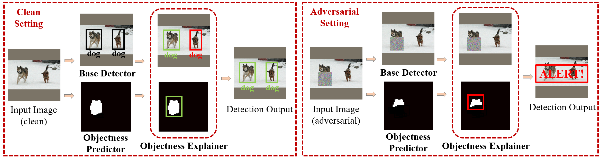

# DetectorGuard: Provably Securing Object Detectors against Localized Patch Hiding Attacks

By [Chong Xiang](http://xiangchong.xyz/), [Prattek Mittal](https://www.princeton.edu/~pmittal/)

Code for "[DetectorGuard: Provably Securing Object Detectors against Localized Patch Hiding Attacks](https://arxiv.org/abs/2102.02956)" in ACM CCS 2021



**Takeaways**: 

1. We design *the first provably robust defense* for object detectors against patch hiding attacks.
2. We achieve a comparable clean performance (in terms of Average Precision) to state-of-the-art object detector while obtaining substantial provable robustness.

###### Check out this [paper list for adversarial patch research](https://github.com/xiangchong1/adv-patch-paper-list) for more fun!


## Requirements
The code is tested with PyTorch 1.7.0. The complete list of required packages are available in `requirement.txt`, and can be installed with `pip install -r requirement.txt`. The code should be compatible with other versions of packages.

## Files
```shell
├── README.md                        #this file 
├── requirement.txt                  #required packages
├── example_cmd.sh                   #example command to run the code
| 
├── clean_run.py                     #experiment with the clean setting and dump files for evaluation
├── clean_eval.py                    #evaluate the clean performance (average precision and false alert rate)
├── provable_run.py                  #experiment for the provable analysis and dump files for evaluation
├── provable_eval.py                 #evaluate the provable robustness (certified recall) 
| 
├── utils
|   ├── bagnet.py                    #BagNet model definitions
|   ├── box_utils.py                 #utils for boxing bounding operations
|   ├── dataset.py                   #utils for different datasets
|   ├── defense.py                   #utils for DetectorGuard defenses
|   └── eval_utils.py                #utils for clean performance (AP50) evaluation
| 
├── misc                             #some useful scripts
|   ├── plot_clean.py                #plot precision-recall curve (e.g., Figure 4)
|   ├── plot_provable.py             #plot CR-recall curve (e.g., Figure 5) and per-class analysis (e.g., Figure 6)
|   └── plot_para.py                 #plot Figure 7
| 
├── det                              #directory for prediction outputs of Base Detector
|   ├── README.md                    #details of detection output
|   └── ...                          #detection files
|
├── data   
|   ├── voc                          #data directory for voc
|   ├── coco                         #data directory for coco
|   └── kitti                        #data directory for kitti
|
└── checkpoints                      #directory for checkpoints
    ├── README.md                    #details of checkpoints
    └── ...                          #BagNet model checkpoints
```
## Datasets
- [PASCAL VOC](http://host.robots.ox.ac.uk/pascal/VOC/)
- [MS COCO](https://cocodataset.org/#home)
- [KITTI](http://www.cvlibs.net/datasets/kitti/)

## Usage
- See **Files** for details of each file. 
- Download data in **Datasets** to `data/`.
- Download checkpoints from Google Drive [link](https://drive.google.com/drive/folders/1aezBxFOuGa-EmLMdI5TCXeAFjk2n12Y-?usp=sharing) and move them to `checkpoints`.
- Download Base Detector predictions from Google Drive [link](https://drive.google.com/drive/folders/1aezBxFOuGa-EmLMdI5TCXeAFjk2n12Y-?usp=sharing) and move them to `det` (or you can generate the prediction files by yourself; see `det/README.md` for more details).
  - Note: this repo does not implement Base Detector for simplicity
- See `example_cmd.sh` for example commands for running the code.

If anything is unclear, please open an issue or contact Chong Xiang (cxiang@princeton.edu).

## Citations

If you find our work useful in your research, please consider citing:

```tex
@inproceedings{xiang2021detectorguard,
  author    = {Chong Xiang and Prateek Mittal},
  title     = {DetectorGuard: Provably Securing Object Detectors against Localized Patch Hiding Attacks},
  booktitle = {{ACM} {SIGSAC} Conference on Computer and Communications
               Security ({CCS})},
  publisher = {{ACM}},
  year      = {2021}
}
```

## Todo 

- Add BagNet training scripts
- Add scripts for the KITTI dataset preparation

